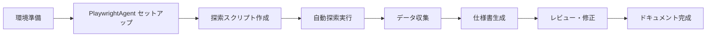

# PlaywrightAgent で Linc'well クリフォア画面仕様書を自動生成

## Summary

- Linc'well クリフォアのウェブアプリを PlaywrightAgent で自動探索し、画面仕様書を生成する
- 3 月入社に向けたキャッチアップと、入社後のオンボーディング効率化の両立を目指す
- 探索結果を構造化ドキュメントとして出力し、チーム全体で活用可能にする

## Problem / Why

**なぜ今やるのか**

- 3 月に Linc'well 入社予定。できる範囲で事前キャッチアップしたい
- 手動での画面確認は時間がかかり、網羅性に欠ける
- 入社後も同様のオンボーディング課題は発生し続ける（新メンバー・異動者等）

**解決したい課題**

- プロダクトの画面構造を体系的に把握したい
- 画面遷移、入力項目、バリデーション等を一覧化したい
- 将来的には新メンバーのオンボーディング資料として活用可能にしたい

## Notes

**関連情報**

- デイリー: [[00.daily/2025-12-16#^20251216-i1]]
- Playwright の自動探索機能（Codegen、Trace Viewer）
- PlaywrightAgent: LLM ベースの自動テスト生成・探索ツール（要調査）

**対象サービス・URL**

- **対象 URL**: https://miniapp.clinicfor.life/home/?online=true
- **サービス範囲**: オンライン診療のみ
- **診療予約の対象**: 保険診療のみ（自由診療は対象外）

**前提条件**

- クリフォアのウェブアプリにアクセス可能である（検証環境 or デモサイト）
- Playwright / PlaywrightAgent の基本的な使い方を理解している or 学習可能
- 画面仕様書のフォーマットが定義されている or 自分で定義可能

**依存・制約**

- **本番環境で実施**（入社前のため検証環境へのアクセス権なし）
  - **絶対 NG 操作**: 最終確定操作（申し込み確定、予約確定、送信、購入完了、削除実行、更新実行等）
  - **許可操作**:
    - 閲覧系: 画面遷移、モーダル表示、検索結果の確認
    - 入力系（途中まで）: 申し込み・予約フローの入力画面、確認画面までの操作
    - **重要**: 確認画面で止める。「確定」「送信」「申し込む」等の最終実行ボタンは押さない
  - **read-only モード**: Playwright は headless=false で目視確認しながら慎重に実行
- 機密情報の取り扱いに注意（スクリーンショット、個人情報、API レスポンス等）
- 探索可能な画面範囲（ログインが必要な場合、アカウント作成は可能か？）
- 本番データへの影響を与えないよう、form submit（最終確定）や API POST/PUT/DELETE は実行しない

## 設計メモ

### 方針

1. **探索フェーズ**: PlaywrightAgent でクリフォアの主要画面を自動巡回し、情報を収集
2. **構造化フェーズ**: 収集した情報を画面仕様書のフォーマットに整形
3. **検証フェーズ**: 生成された仕様書をレビューし、漏れ・誤りを修正

### 技術スタック

- **Playwright**: ブラウザ自動操作
- **PlaywrightAgent**: LLM ベースの探索エージェント（要調査）
  - 代替: Playwright Codegen + カスタムスクリプト
- **出力形式**: Markdown（Obsidian で管理）、または Excel/CSV

### 探索スコープ

**対象範囲**

- **URL**: https://miniapp.clinicfor.life/home/?online=true
- **サービス**: オンライン診療
- **診療種別**: 保険診療のみ（自由診療は対象外）

**Phase 1（最小構成）**

- [ ] トップ画面（ホーム）
- [ ] 新規入会導線（複数パターンを整理）
  - [ ] 導線の種類を特定
  - [ ] 各導線の入会後のアカウント状態への影響を調査
- [ ] ログイン画面
- [ ] 診療予約フロー（保険診療）
  - [ ] 診療科目選択
  - [ ] 予約日時選択
  - [ ] 患者情報入力
  - [ ] 確認画面（ここで止める。確定ボタンは押さない）

**Phase 2（拡張）**

- [ ] マイページ/ダッシュボード
- [ ] 予約履歴・キャンセル画面
- [ ] プロフィール編集画面
- [ ] モーダル、サイドパネル等の UI コンポーネント
- [ ] エラー画面、バリデーションメッセージ

### 新規入会導線の整理

新規入会の導線パターンとアカウント状態への影響を調査・整理する。

**調査項目**

1. **入会導線の種類**

   - トップページからの直接入会
   - 診療予約フローからの入会（予約と同時に入会）
   - 特定のキャンペーンページからの入会
   - その他の導線パターン

2. **各導線のフロー**

   - 導線ごとの入力画面の違い
   - 必須項目・任意項目の差異
   - バリデーションルールの違い

3. **入会後のアカウント状態への影響**

   - 入会完了後の初期状態（プロフィール完成度、設定済み項目）
   - 予約ステータス（導線によって予約が自動で入るか）
   - 利用可能な機能の違い（即座に診療予約可能か、追加設定が必要か）
   - 会員種別・ステータスの違い（あれば）

4. **わかる範囲での整理**
   - 確定操作はしないため、完全な状態は確認できない
   - 確認画面の表示内容、API レスポンスから推測可能な範囲で整理
   - 不明な点は「要確認」として記録

### 画面仕様書のフォーマット

各画面について以下を記録：

#### 基本情報

- **画面名**: 画面の名称（例: ログイン画面、ダッシュボード）
- **URL/パス**: 画面の URL またはルーティングパス
- **目的**: この画面で何ができるか、何を目的としているか
- **アクセス方法**: どこからこの画面に遷移できるか（リンク、ボタン等）

#### UI コンポーネント情報

各コンポーネントについて以下を記録：

**入力コンポーネント**

- **コンポーネント種別**: `textbox | textarea | select | radio | checkbox | datepicker | file-upload`
- **ラベル/名称**: 画面上の表示名（例: 「メールアドレス」「パスワード」）
- **name/id 属性**: HTML の name または id 属性値（技術的な識別子）
- **必須/任意**: required か optional か
- **バリデーション**:
  - 形式チェック（例: メールアドレス形式、数値のみ、etc.）
  - 文字数制限（最小/最大）
  - 許可文字（英数字のみ、全角カナのみ、etc.）
  - エラーメッセージ（バリデーション失敗時の表示内容）
- **初期値/プレースホルダー**: デフォルト値や入力例の表示
- **操作時の挙動**:
  - フォーカス時の動作（ハイライト、ツールチップ表示等）
  - 入力中の動作（リアルタイムバリデーション、自動補完等）
  - ブラー時の動作（フォーマット調整、確認表示等）

**ボタン・リンク**

- **コンポーネント種別**: `button | link | icon-button | dropdown-menu`
- **ラベル/名称**: ボタンやリンクの表示テキスト
- **操作時の挙動**:
  - クリック時の動作（画面遷移、モーダル表示、API 呼び出し等）
  - 遷移先（URL、画面名）
  - 確認ダイアログの有無
  - ローディング表示の有無
- **活性/非活性条件**: どういう条件でボタンが押せる/押せないか

**表示コンポーネント**

- **コンポーネント種別**: `table | list | card | chart | image | text-label`
- **表示データ**: 何のデータを表示しているか（例: ユーザー一覧、注文履歴等）
- **カラム/項目**: テーブルやリストの場合、各カラム/項目の名称とデータ型
- **操作**: ソート、フィルタ、ページング、行クリック等の操作可否

**モーダル・ダイアログ**

- **トリガー**: どのボタン/リンクから開くか
- **内容**: モーダル内の入力項目、表示内容
- **アクション**: OK/キャンセルボタンの挙動

#### バックエンド情報（取得可能な範囲で）

- **API エンドポイント**: Network タブで確認できる API の URL（GET のみ）
  - **取得対象**: GET リクエストのみ（閲覧系のみ）
  - **除外**: POST/PUT/DELETE（データ変更系は記録しない）
- **リクエストパラメータ**: クエリパラメータ、パスパラメータ（個人情報は伏せ字）
- **レスポンス構造**: JSON の大まかな構造（キー名、データ型）を記録（値は伏せ字）
  - 例: `{"user": {"id": "***", "name": "***", "email": "***"}}`
- **エラーレスポンス**: エラー時のステータスコードとエラーメッセージ形式

**注意事項**

- 個人情報、機密情報は記録しない（\*\*\*で伏せ字にする）
- API の実データは記録せず、構造のみを記録
- POST/PUT/DELETE リクエストは発生させない（form submit しない）

#### その他

- **スクリーンショット**: 画面全体のキャプチャ（機密情報はモザイク処理）
- **備考**: 気づいた点、不明点、要確認事項等

### 実装フロー



### 論点・リスク

- **PlaywrightAgent の学習コスト**: どの程度の時間で習得可能か？
  - → まずは Playwright 単体で試し、必要に応じて Agent 導入
- **クリフォアへのアクセス権**: 検証環境は事前に利用可能か？
  - → 不明な場合は事前に確認が必要
- **仕様書のメンテナンス**: アプリの更新時に仕様書も更新が必要
  - → 自動化スクリプトを残しておくことで再実行可能にする

### マイルストーン

- **Week 1 (Draft)**: Playwright 環境構築 + 基本的な探索スクリプト作成
- **Week 2 (Review)**: 主要画面の探索実行 + 仕様書 v0.1 生成
- **Week 3 (Implement)**: フォーマット調整 + 追加画面の探索
- **Week 4 (Done)**: 最終レビュー + ドキュメント完成・共有

## 決定事項 / TODO

### 決定事項

- **対象スコープ**
  - URL: https://miniapp.clinicfor.life/home/?online=true
  - オンライン診療のみ
  - 診療予約は保険診療のみ（自由診療は対象外）
- **本番環境で実施**（入社前のため検証環境なし）
  - 最終確定操作（申し込み確定、予約確定、送信等）は絶対に行わない
  - 申し込み・予約フローは確認画面まで操作 OK
  - headless=false で目視確認しながら慎重に実行
- **新規入会導線の整理**
  - 導線の種類を特定し、各導線の入会フローを記録
  - 入会後のアカウント状態への影響をわかる範囲で整理
  - 確認画面や API レスポンスから推測可能な情報を記録
- PlaywrightAgent が不明な場合は、まず Playwright 単体でプロトタイプを作る
- 出力フォーマットは Markdown（Obsidian 管理）を第一候補とする
- 探索範囲は Phase 1（最小構成）から開始する
- UI コンポーネント情報（種別、バリデーション、挙動）を詳細に記録
- バックエンド情報は GET リクエストのみを記録（構造のみ、実データは伏せ字）

### 次のアクション

- [ ] PlaywrightAgent の情報収集（公式ドキュメント、GitHub、記事等）
- [ ] Playwright の環境構築（Node.js、Playwright インストール）
- [ ] 対象 URL（https://miniapp.clinicfor.life/home/?online=true）にアクセスし手動で構造確認
- [ ] 新規入会導線の種類を特定（トップからの入会、予約フローからの入会等）
- [ ] 最小スクリプト作成: トップ → 新規入会フロー（確認画面まで） → スクリーンショット保存
- [ ] 保険診療の予約フローを手動で確認（確認画面まで）
- [ ] 画面仕様書のテンプレート Markdown ファイルを作成
- [ ] 探索スクリプトを実行し、1 画面分の仕様書を手動生成（フォーマット検証）
- [ ] 新規入会導線ごとのアカウント状態の違いを整理（わかる範囲で）
- [ ] フィードバックを受けて、自動化スクリプトを改良

### 完了条件

- クリフォアの主要画面の仕様書が Markdown で生成されている
- 仕様書に画面名、URL、入力項目、ボタン、スクリーンショットが含まれている
- 探索スクリプトが再実行可能な状態で保存されている
- オンボーディング資料として活用できる

## Appendix

### 画面仕様書テンプレート（Markdown）

````md
---
type: screen-spec
product: clinicfor-miniapp
screen-name:
screen-id:
url:
stage: draft # draft | reviewed | done
owner:
last-updated: { { date:YYYY-MM-DD } }
tags: [spec, screen, clinicfor]
source-explore:
  explored-at:
  explored-by: PlaywrightAgent
  trace:
  screenshot:
---

# 画面仕様書: {{screen-name}}

## 1. 基本情報

- 画面名:
- URL/パス:
- 目的:
- 対象ユーザー/権限:
- 前提条件（ログイン状態・フローの進行状況など）:
- 遷移元:
- 遷移先:

## 2. UI コンポーネント

### 2.1 入力項目

|  No | ラベル | 種別                                                          | name/id | 必須              | バリデーション                        | 初期値/placeholder | 操作時の挙動                 | Playwright locator | 備考 |
| --: | ------ | ------------------------------------------------------------- | ------- | ----------------- | ------------------------------------- | ------------------ | ---------------------------- | ------------------ | ---- |
|   1 |        | textbox/textarea/select/radio/checkbox/datepicker/file-upload |         | required/optional | 形式/文字数/許可文字/エラーメッセージ |                    | フォーカス時/入力中/ブラー時 |                    |      |

**操作時の挙動の詳細例:**

- フォーカス時: ハイライト、ツールチップ表示、ヘルプテキスト表示
- 入力中: リアルタイムバリデーション、自動補完候補表示、文字数カウント表示
- ブラー時: フォーマット自動調整（全角 → 半角、日付形式統一等）、最終バリデーション

### 2.2 ボタン/リンク

|  No | ラベル | 種別                                  | 活性条件 | クリック時の挙動                            | 遷移先/結果 | 確認ダイアログ | ローディング表示 | Playwright locator | 備考 |
| --: | ------ | ------------------------------------- | -------- | ------------------------------------------- | ----------- | -------------- | ---------------- | ------------------ | ---- |
|   1 |        | button/link/icon-button/dropdown-menu |          | 画面遷移/モーダル表示/API 呼び出し/状態変更 |             | あり/なし      | あり/なし        |                    |      |

### 2.3 危険操作（最終確定など）

※ 本番探索時は「確定/送信/購入/削除/更新」などの最終実行を行わない。

|  No | ラベル | 種別 | 想定される影響 | 備考 |
| --: | ------ | ---- | -------------- | ---- |
|   1 |        |      |                |      |

### 2.4 表示項目（テーブル/リスト/カード等）

|  No | 名称 | 種別                                   | 表示データ | カラム/項目        | 操作（ソート/フィルタ/ページング等） | 各行/項目のアクション  | Playwright locator | 備考 |
| --: | ---- | -------------------------------------- | ---------- | ------------------ | ------------------------------------ | ---------------------- | ------------------ | ---- |
|   1 |      | table/list/card/chart/image/text-label |            | カラム名: データ型 | ソート可/フィルタ可/ページング有     | 行クリック/編集/削除等 |                    |      |

**カラム/項目の詳細記載例:**

- 「ID: 数値, 氏名: 文字列, 登録日: 日付(YYYY-MM-DD), ステータス: enum(active/inactive)」

### 2.5 モーダル/ダイアログ

|  No | 名称 | トリガー          | 内容（入力項目/表示内容）  | アクション（ボタン）   | 各ボタンの挙動                 | 閉じる条件                     | 備考 |
| --: | ---- | ----------------- | -------------------------- | ---------------------- | ------------------------------ | ------------------------------ | ---- |
|   1 |      | ボタン名/リンク名 | 入力項目一覧, 表示テキスト | OK/キャンセル/閉じる等 | API 呼び出し/画面遷移/状態変更 | × ボタン/背景クリック/ESC キー |      |

### 2.6 その他の UI 要素（見落としがちなもの）

|  No | 種別             | 名称/内容               | 表示条件       | 操作/挙動                    | Playwright locator | 備考 |
| --: | ---------------- | ----------------------- | -------------- | ---------------------------- | ------------------ | ---- |
|   1 | ツールチップ     | ? アイコンのヘルプ      | ホバー時       | -                            |                    |      |
|   2 | トースト/通知    | 成功/エラー通知         | 操作完了時     | 自動消滅/× で閉じる          |                    |      |
|   3 | ローディング     | スピナー/プログレスバー | API 呼び出し中 | -                            |                    |      |
|   4 | ブレッドクラム   | パンくずリスト          | -              | リンククリックで遷移         |                    |      |
|   5 | タブ             | タブ切り替え            | -              | クリックでコンテンツ切り替え |                    |      |
|   6 | アコーディオン   | 開閉式セクション        | -              | クリックで開閉               |                    |      |
|   7 | ドロップダウン   | メニュー展開            | ボタンクリック | 項目選択で処理実行           |                    |      |
|   8 | ページネーション | 1/2/3/次へ等            | -              | ページ遷移                   |                    |      |

## 3. バリデーション/エラー

### 3.1 入力項目別バリデーション詳細

| 項目名         | バリデーション種別 | ルール         | エラーメッセージ                              | トリガータイミング | 備考 |
| -------------- | ------------------ | -------------- | --------------------------------------------- | ------------------ | ---- |
| メールアドレス | 形式チェック       | RFC 準拠の形式 | 「メールアドレスの形式が正しくありません」    | ブラー時/送信時    |      |
| パスワード     | 文字数             | 8 文字以上     | 「パスワードは 8 文字以上で入力してください」 | 入力中/送信時      |      |
|                | 許可文字           | 英数字記号のみ | 「使用できない文字が含まれています」          | 入力中             |      |

**バリデーション種別の分類:**

- 形式チェック: メール形式、電話番号形式、郵便番号形式、URL 形式等
- 文字数制限: 最小文字数、最大文字数
- 許可文字: 半角英数字のみ、全角カナのみ、数値のみ等
- 値の範囲: 数値の最小値/最大値、日付の範囲等
- 関連項目チェック: パスワード確認との一致、開始日＜終了日等
- 重複チェック: メールアドレスの重複、ID 重複等（API 側の検証）

### 3.2 画面レベルのエラー

| エラー種別     | 発生条件                     | 表示箇所          | エラーメッセージ例                                               | 復旧方法                  | 備考 |
| -------------- | ---------------------------- | ----------------- | ---------------------------------------------------------------- | ------------------------- | ---- |
| API 通信エラー | ネットワーク断、タイムアウト | 画面上部トースト  | 「通信エラーが発生しました。しばらくしてから再度お試しください」 | 再試行ボタン/画面リロード |      |
| 権限エラー     | 未ログイン、権限不足         | 画面全体/モーダル | 「この操作を行う権限がありません」                               | ログイン画面へ遷移        |      |
| データ不整合   | 必須データ欠落               | フォーム上部      | 「入力内容に不備があります。赤字の項目を修正してください」       | 該当項目を修正            |      |
| サーバーエラー | 500 系エラー                 | エラー画面        | 「システムエラーが発生しました」                                 | トップに戻る/サポート連絡 |      |

### 3.3 エラーメッセージ一覧（PII は \*\*\* で伏せ字）

**クライアント側バリデーション:**

-
-

**サーバー側エラー（API レスポンス）:**

-
-

## 4. API（GET のみ／実データは記録しない）

### 4.1 API 呼び出し一覧

|  No | 用途           | タイミング | エンドポイント     | メソッド | リクエスト | レスポンス    | エラーパターン | 備考 |
| --: | -------------- | ---------- | ------------------ | -------- | ---------- | ------------- | -------------- | ---- |
|   1 | 初期データ取得 | 画面表示時 | /api/users/profile | GET      | -          | 下記 4.2 参照 | 401, 404, 500  |      |

### 4.2 API 詳細仕様（実データは記録せず構造のみ）

#### API #1: [用途を記載]

**基本情報**

- エンドポイント: `/api/***`
- メソッド: `GET`
- 呼び出しタイミング: 画面表示時/ボタンクリック時等

**リクエスト**

- **ヘッダー**: `Authorization: Bearer ***`
- **クエリパラメータ**:
  ```json
  {
    "userId": "***",
    "filter": "active",
    "page": 1,
    "limit": 20
  }
  ```
````

- **パスパラメータ**: `/api/users/{userId}`

**レスポンス（正常時）**

- **ステータスコード**: `200 OK`
- **レスポンスボディ構造**:
  ```json
  {
    "user": {
      "id": "***",
      "name": "***",
      "email": "***",
      "createdAt": "2025-01-01T00:00:00Z",
      "status": "active"
    },
    "metadata": {
      "totalCount": 100,
      "page": 1,
      "hasNext": true
    }
  }
  ```

**エラーレスポンス**

- **401 Unauthorized**:
  ```json
  {
    "error": {
      "code": "UNAUTHORIZED",
      "message": "認証が必要です"
    }
  }
  ```
- **404 Not Found**:
  ```json
  {
    "error": {
      "code": "USER_NOT_FOUND",
      "message": "ユーザーが見つかりません"
    }
  }
  ```
- **500 Internal Server Error**:
  ```json
  {
    "error": {
      "code": "INTERNAL_ERROR",
      "message": "サーバーエラーが発生しました"
    }
  }
  ```

**UI への影響**

- 正常時: プロフィール情報を画面に表示
- 401 エラー時: ログイン画面へリダイレクト
- 404 エラー時: 「ユーザーが見つかりません」メッセージ表示
- 500 エラー時: エラー画面表示

**注意事項**

- 個人情報（名前、メール等）は \*\*\* で伏せ字
- 実際の ID やトークンは記録しない
- POST/PUT/DELETE は本番環境では実行しないため記録対象外

## 5. スクリーンショット/証跡

- スクリーンショット:
- Trace:
- A11y snapshot（あれば）:
- メモ（再現手順・観測した挙動など）:

## 6. 備考/要確認

-

```

```
